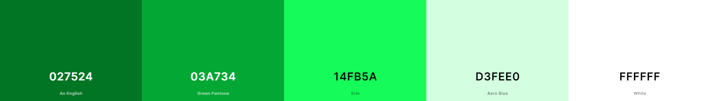
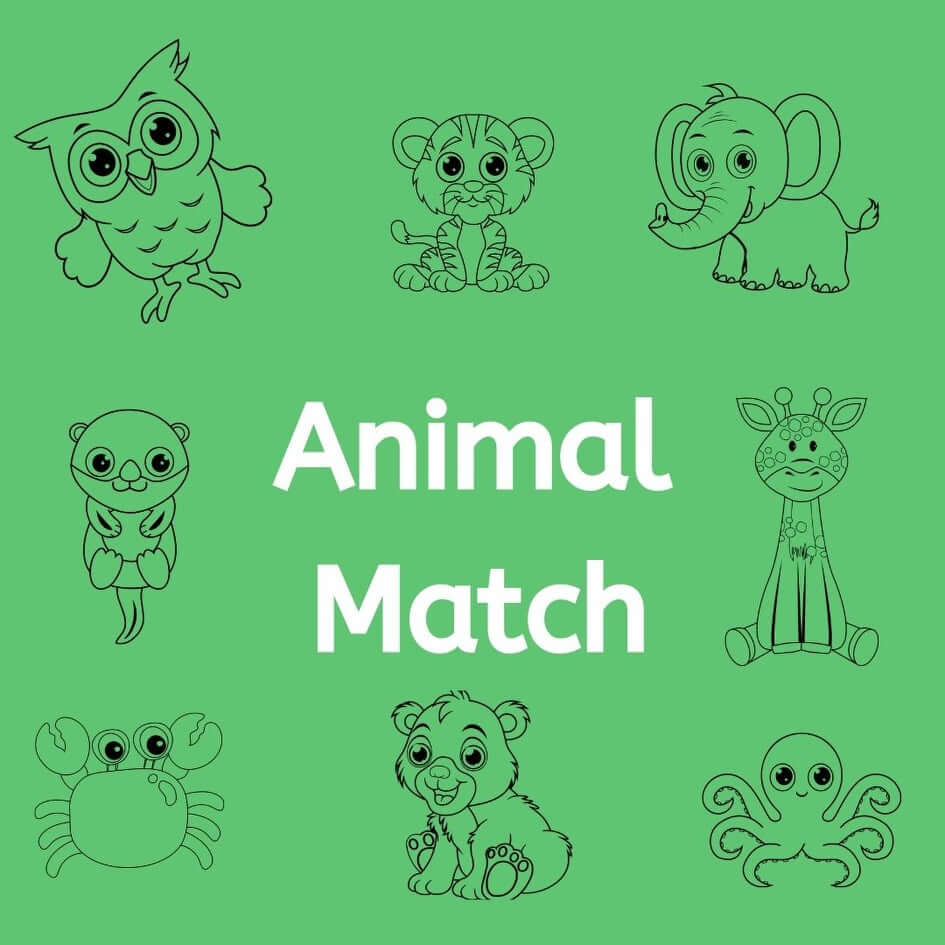
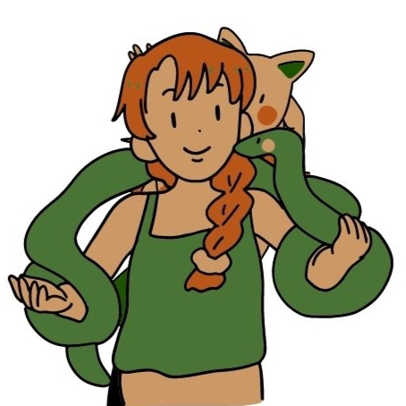
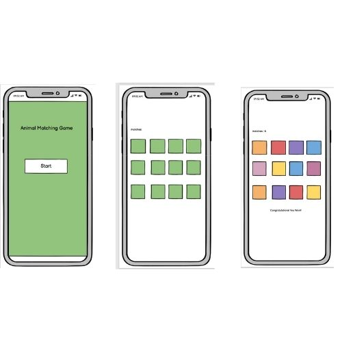

# Animal Match
A memory matching game for children. It hopes to provide a fun gaming experience with eyecatching images and entertaining game objectives.

## User Experience
***

### First Time Visitor Goals
* As a first time visitor, I want to easily understand how to play the game.
* As a first time visitor, I want to easily navigate to the game page.

### Returning Visitor Goals
* As a returning visitor, I want to play interactively with them game.
* As a returning visitor, I want to be told when i have won and lost.

### Frequent User Goals
* As a frequent visitor, I want to be able to restart the game to play again.
* As a frequent visitor, I want to be able to play the game with different matching variaties.

## Design
*** 

### Colour scheme
The colour scheme of the website is various shades of greens. These were chosen as they are colours that are associated with animals and zoos.

### Typography
'Fuzzy Bubbles' was the chosen as the title font for this game as it is eye catching and fun to match the game.
'ABeeZee' was the chosen font for this game as it is a children's learning font and is friendly and easy to read. 'Sans Serif' was used as the fallback font for the website in case the other fonts do not load properly.

### Images
The images used on the website are of cartoon animals and a cartoon zookeeper to match the games zoo and animal rescue theme and appeal to children who are the target user for ther game.
 
 

### Wireframes

## Features
### Start Menu

### Game Instructions
### Timer
### Matches
### Game 
### Won Alert 
### Lost Alert
### Restart
### Future Features

## Techonology Uase

## Deployment

## Testing
***
### Please find the informaton on testng the 'Animal Matching Game' website [HERE](TESTING.md).

## Creadit

