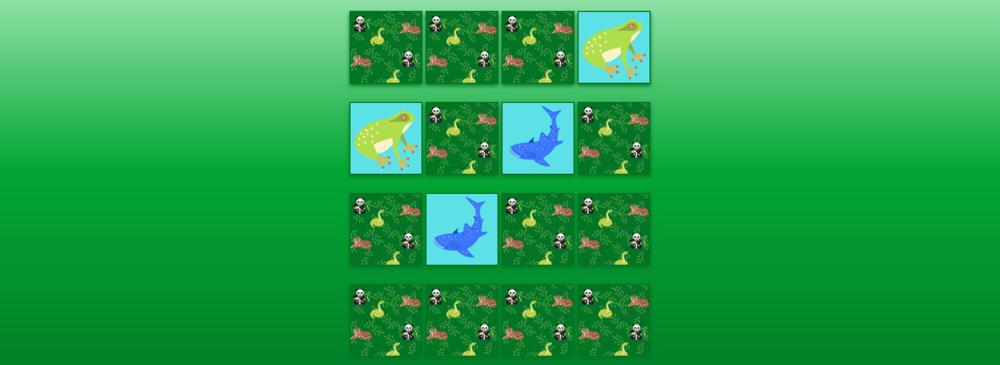
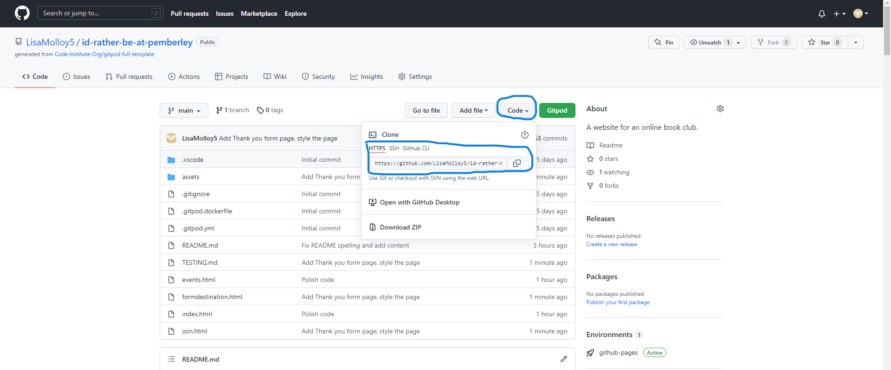

# Animal Match
A memory matching game for children. It hopes to provide a fun gaming experience with eyecatching images and entertaining game objectives.
[Animal Match](https://lisamolloy5.github.io/animal-matching-game/)

## User Experience
***

### First Time Visitor Goals
* As a first time visitor, I want to easily understand how to play the game.
* As a first time visitor, I want to easily navigate to the game page.

### Returning Visitor Goals
* As a returning visitor, I want to play interactively with them game.
* As a returning visitor, I want to be told when i have won and lost.

### Frequent User Goals
* As a frequent visitor, I want to be able to restart the game to play again.
* As a frequent visitor, I want to be able to play the game with different matching variaties.

## Design
*** 

### Colour scheme
The colour scheme of the website is various shades of greens. These were chosen as they are colours that are associated with animals and zoos.

### Typography
'Fuzzy Bubbles' was the chosen as the title font for this game as it is eye catching and fun to match the game.
'ABeeZee' was the chosen font for this game as it is a children's learning font and is friendly and easy to read. 'Sans Serif' was used as the fallback font for the website in case the other fonts do not load properly.

### Images
The images used on the website are of cartoon animals and a cartoon zookeeper to match the games zoo and animal rescue theme and appeal to children who are the target user for ther game.
***
 
 

### Wireframes

## Features
### Start Menu
***
* The game name 'Animal Match' sits at the top of the game menu.
* A 'Start' button that brings the user to the game page and a 'How to play' button which opens the intructions pop up are contained within the menu.

### Game Instructions
***
* The game instructions are contained within a pop up when the 'How to play' button is clicked.
* It provides the user with the background to the game and instructions on how to play the game.

### Timer
***
* A timer that is 120 seconds long and countsdown while the user plays the game.
* When the timer reaches zero a pop up alerts the player they have lost.

### Matches
*** 
* Displays the matches gotten to the user as they play through the game.
* When the player reaches 8 matchs a pop up alerts the player that they have won.

### Game 
***
* The game consists of sixteen cards that can be flipped.
* The aim of the game is to match each animal with it's pair before the time runs out.

### Won Alert 
***
* A pop up that slerts the player that they have won the game.
* The quit button brings the player back to the home page.
* The play again button restarts the game over again.

### Lost Alert
***
* A pop up that slerts the player that they have lost the game.
* The quit button brings the player back to the home page.
* The play again button restarts the game over again.

### Back / Restart
***
* The back button brings the player back to the home page.
* The restart button restarts the game over again.

### Future Features
*** 
* With more time I would like to implement sounds into the game as well as different game modes.

## Techonology Used
***
* [HTML5](https://en.wikipedia.org/wiki/HTML5) was the coding language used.
* [CSS3](https://en.wikipedia.org/wiki/CSS) was the coding language used to style the website.
* [Balsamiq](https://balsamiq.com/) was used to create the website wireframes.
* [Tinyjpg](https://tinyjpg.com/) was used to compress images.
* [Google Fonts](https://fonts.google.com/) was used for the fonts on the website.
* [Canva](https://www.canva.com/signup) was used to create and style the site images.
* [Gitpod](https://www.gitpod.io/) was used to write and edit the code.
* [Github](https://github.com/) was used to host and deploy the website.

## Deployment
***
#### Github Deployment
This project was deployed to GitHub Pages. To deploy 

1. Log in or join GitHub.
2. Find the GitHub Repository.
3. Locate the setting part of thr Repository menu.
4. Find the pages part of settings and click it.
5. Click the 'source' dropdown named 'none' and change it to 'Master Branch.
6. Click save.
7. The page will refresh automatically with the successfully deployed website.

Link to the GitHub repository ['Animal Mathch'](https://github.com/LisaMolloy5/animal-matching-game)

#### Make a local clone of the Repository

1. Log in or join Github.
2. Fnd the Github repository.
3. Locate the 'Code' button dropdown and click it.
4. Select 'HTTPS' to clone using HTTPS and copy the link or click the clipboard button.
5. Open Git Bash.
6. Replace the current working directory to the location you wish the cloned directory to be made.
7. Type git clone, and paste the URL from copied in step 4.

## Testing
***
### Please find the informaton on testng the 'Animal Matching Game' website [HERE](TESTING.md).

## Credit
***
### Code Used
* [CSS gradient tutorial used](https://www.w3schools.com/css/css3_gradients.asp)

* [Box Sahdow tutorial used](https://www.w3schools.com/css/css3_shadows_box.asp#:~:text=The%20CSS%20box-shadow%20property%20is%20used%20to%20apply,color%20of%20the%20shadow%20is%20the%20current%20text-color)

* [Game tutorial followed.](https://www.youtube.com/watch?v=ZniVgo8U7ek)

* [Creating a Simple Footer With Flexbox](https://www.codegrepper.com/code-examples/javascript/javascript+countdown+timer+minutes%2C+seconds)

* [Code adapted for the timer function](https://css-tricks.com/snippets/css/a-guide-to-flexbox/)

* [Used for the safari backface visibilty bug](https://www.w3schools.com/CSSref/css3_pr_backface-visibility.asp)

---

## Content
* All content was written by the developer.
* All images were design by author using [Canva](https://www.canva.com/signup) free elements.

## Acknowledgements
* I would like to thank [Precious Ijege](https://www.linkedin.com/in/precious-ijege-908a00168/) my mentor for his continuous help throughout my project.
* I would like to thank my tutor Kasia Bogucka. 
* I would also like to thank the Slack Community and tutor support for the feedback and help provided.

2022 Lisa Molloy

