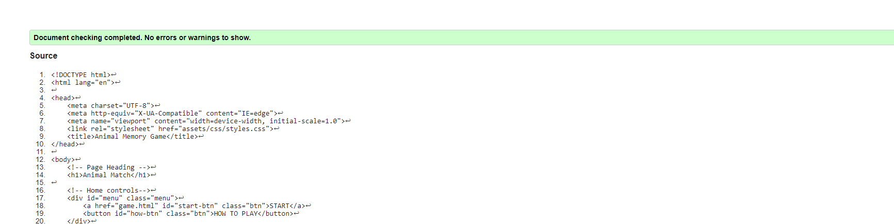
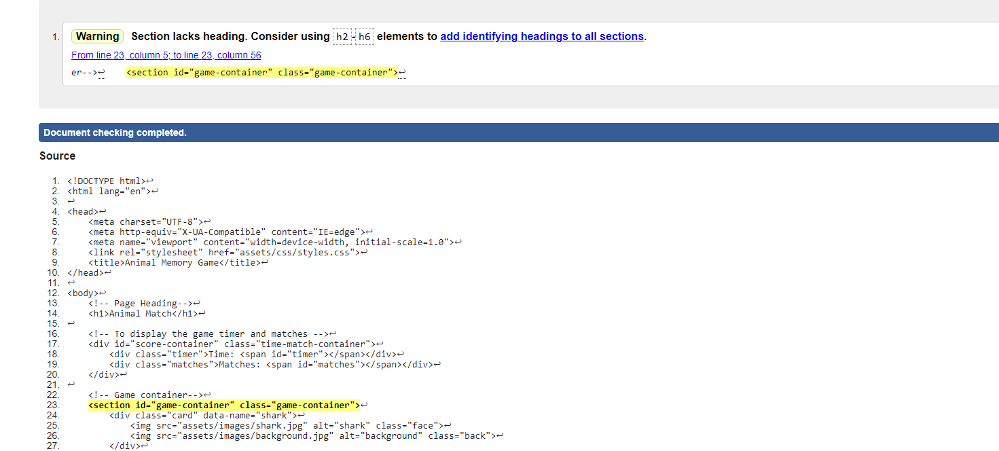
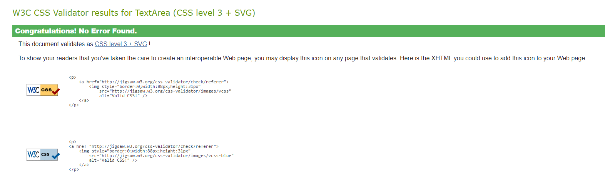
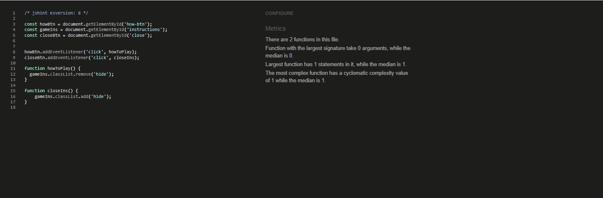
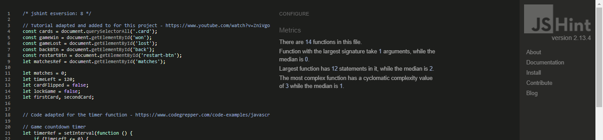

# Testing

## Code Validation 
The 'Animal Matching Game' website was tested thoroughly. All code was ran though W3C html Validator, W3C CSS Validator and Jshint to validate it. Minor bugs were found and fixed so that no errors were returned.

### HTML Validator Results
***
* Home Page

* Game Page

### CSS Validator Results
***

### JavaScript Validator Results
***
* Home page

* Game page

***

## User Stories Testing
***
### First Time Visitor Goals
* As a first time visitor, I want to easily understand how to play the game.
 1. On entering the game the user is greeted with a menu consisting of a 'Start' button and a 'How to play' button.
 2. When clicked the 'How to play' displays a pop up giving a storie to the game and instructions on how to play"

* As a first time visitor, I want to easily navigate to the game page.
 1.  On entering the game the user is greeted with a menu consisting of a 'Start' button and a 'How to play' button.
 2. When clicked the 'Start' button leads the user to the game page.

### Returning Visitor Goals

* As a returning visitor, I want to play interactively with them game.

 1. When the user enter the game page they are greeted with the game which consists of sixteen game cards.
 2. Each game card can be clicked to flip the cards face forward.
 3. A second game card can be clicked and flipped face forward and remain that way if the faces match.

* As a returning visitor, I want to be told when i have won and lost.
 1. When the user matches all cards correctly to their pairs and when the 'Matches' number reaches eight a popup display letting the user know they have won.
 2. If the 'Time' feature reaches zero, then a popup display alerts the user they have lost and ran out of time.

### Frequent User Goals

* As a frequent visitor, I want to be able to restart the game to play again.
 1. Beneathe the game container there are two clickable button. On to return to the home page and one to restart the game.
 2. The 'Won' and 'Lost' pop up displays also containe a 'Quit' and a 'Play again' btn allowing the user to play again if they wish.

* As a frequent visitor, I want to be able to play the game with different matching variaties.
 1. The shuffle function within the game allows the cards to be randomized when the game has loaded.
 2. Once the user presses 'Restart' or 'Play again' the order of the cards is shuffled.
***

## Responsive Testing
***
* Responsive design testing for the game website was carried out using [Google Chrome Dev Tools](https://www.google.com/chrome/dev/) and [Responsive Design Checker](https://responsivedesignchecker.com/)

* The website was checked on various devices such as Galaxy Fold, Iphone 5/SE, Iphone X, Samsung Galay S8+, Nokia N9, Ipad, Galaxy Tab, Laptop and Desktop.

* The game website was checked on all devices and orientations to check that all aspects of the game where withing the screen and not too small or too large.

* Any issues that were shown, such as the website heading being to large on smaller mobile screens, the game being to large in landscape oreintation and the game being too small for larger screens, were fixed using media queries.

 # Browser Compatibility Testing 
  
  * This Website was tested on the browsers Google Chrome, Safari, Microsoft Edge and Mozilla Firefox.
  * The functionality of each page of the game website was checked to make sure they worked.
  * The appearance of the website was checked on each browser to make sure nothing was out of place.
