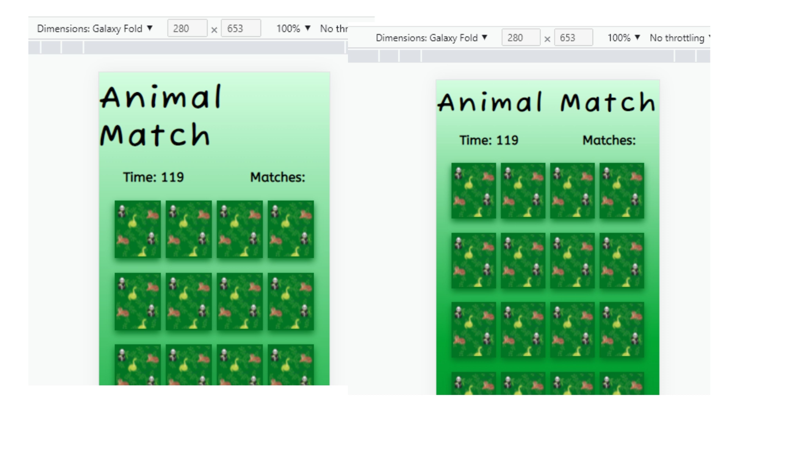
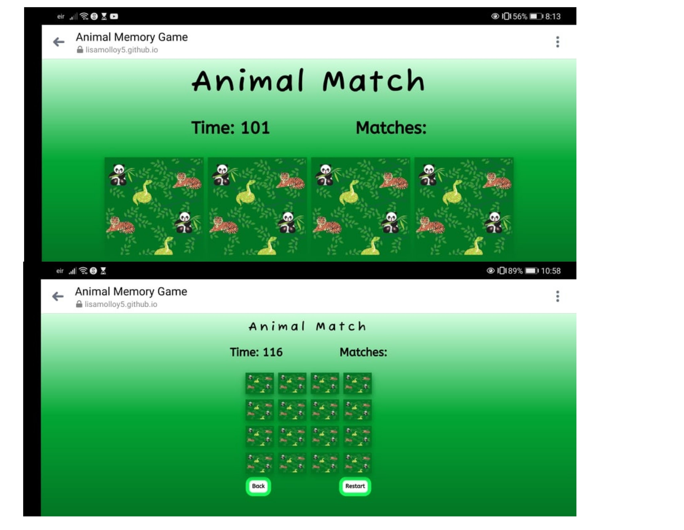

# Testing

## Code Validation 
The 'Animal Matching Game' website was tested thoroughly. All code was ran though W3C html Validator, W3C CSS Validator and Jshint to validate it. Minor bugs were found and fixed so that no errors were returned.

### HTML Validator Results
***
* Home Page

* Game Page

### CSS Validator Results
***

### JavaScript Validator Results
***
* Home page

* Game page

***

## User Stories Testing
***
### First Time Visitor Goals
* As a first time visitor, I want to easily understand how to play the game.
 1. On entering the game the user is greeted with a menu consisting of a 'Start' button and a 'How to play' button.
 2. When clicked the 'How to play' displays a pop up giving a storie to the game and instructions on how to play"

* As a first time visitor, I want to easily navigate to the game page.
 1.  On entering the game the user is greeted with a menu consisting of a 'Start' button and a 'How to play' button.
 2. When clicked the 'Start' button leads the user to the game page.

### Returning Visitor Goals

* As a returning visitor, I want to play interactively with them game.

 1. When the user enter the game page they are greeted with the game which consists of sixteen game cards.
 2. Each game card can be clicked to flip the cards face forward.
 3. A second game card can be clicked and flipped face forward and remain that way if the faces match.

* As a returning visitor, I want to be told when i have won and lost.
 1. When the user matches all cards correctly to their pairs and when the 'Matches' number reaches eight a popup display letting the user know they have won.
 2. If the 'Time' feature reaches zero, then a popup display alerts the user they have lost and ran out of time.

### Frequent User Goals

* As a frequent visitor, I want to be able to restart the game to play again.
 1. Beneathe the game container there are two clickable button. On to return to the home page and one to restart the game.
 2. The 'Won' and 'Lost' pop up displays also containe a 'Quit' and a 'Play again' btn allowing the user to play again if they wish.

* As a frequent visitor, I want to be able to play the game with different matching variaties.
 1. The shuffle function within the game allows the cards to be randomized when the game has loaded.
 2. Once the user presses 'Restart' or 'Play again' the order of the cards is shuffled.
***

## Responsive Testing
***
* Responsive design testing for the game website was carried out using [Google Chrome Dev Tools](https://www.google.com/chrome/dev/) and [Responsive Design Checker](https://responsivedesignchecker.com/)

* The website was checked on various devices such as Galaxy Fold, Iphone 5/SE, Iphone X, Samsung Galay S8+, Nokia N9, Ipad, Galaxy Tab, Laptop and Desktop.

* The game website was checked on all devices and orientations to check that all aspects of the game where withing the screen and not too small or too large.

* Any issues that were shown, such as the website heading being to large on smaller mobile screens, the game being to large in landscape oreintation and the game being too small for larger screens, were fixed using media queries.

# Browser Compatibility Testing 

* This Website was tested on the browsers Google Chrome, Safari, Microsoft Edge and Mozilla Firefox.
* The functionality of each page of the game website was checked to make sure they worked.
* The appearance of the website was checked on each browser to make sure nothing was out of place.

# Known Bugs
  
### Validation Bugs
***
- There was a parse error within my CSS media queries which was easily rectified.

- There was a error with my lockGame function within my JavaScript. I had wrote it as a variable. Once i had removed the let variable command it was fixed.

***

### Responsive Bugs
---
While testing the responsive design of the website some bugs were encountered. These were fixed using media queries.

* The game website heading was too large for smaller mobiler screens.

* The instructions were askew on mobile devices.

* The game container was too small on tablet, ipad and desktop screens.
 

* The game was too large and unplayable in landscape orientation.

***

### Functionality Bugs
***
## Three cards clicked bug

* When playing the game i noticed three cards could be clicked at the one time.
* This caused an error in the game and left some cards unflipped, while others remained flipped.

* This was rectified by adding a lockGame variable that lasts for a second.
* Once two cards have been unflipped then the user can click more cards.

## Matches bug

* Issues with matches occured during the game development.
* When all the matches had been found and the 'Matches Feature" had reached eight,I had an issue with getting the game won alert to pop up.

* This was due to having reassigned the matches variable to 0.
* I created serperate variables for the matches span and the number withing the matches.

## Double click bug

* When playing the game when one card was clicked twice it was displaying as a match.
* The card was then unclickable when it was unflipped.

* This was rectified by removing the event listener when the first card was clicked.

## Unflipped cards bug

* Having fixed the double click bug, this created its own bug.
* Once the event listener was removed from the first card clicked, once the cards unflipped , the card remained unclickable.
* This was rectified by adding the event listener back to the cards once they were unflipped.

## Safari 

* There was an issue with card visibiltiy in the safari browser. 
* This was rectified using safari web-kits.

* This was rectified using safari web-kits.

### Lighthouse Testing
- This website was tested using the [Google Lighthouse](https://developers.google.com/web/tools/lighthouse/) feature.
## Home page

### Mobile

* 

### Desktop
 
* 

## Game page

### Mobile

* 

### Desktop
 
* )
